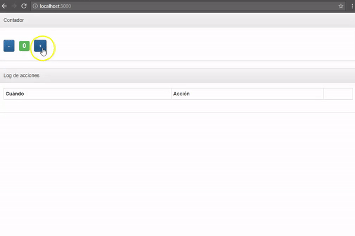
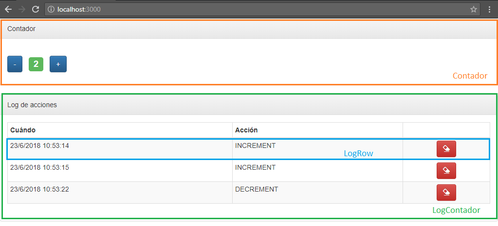
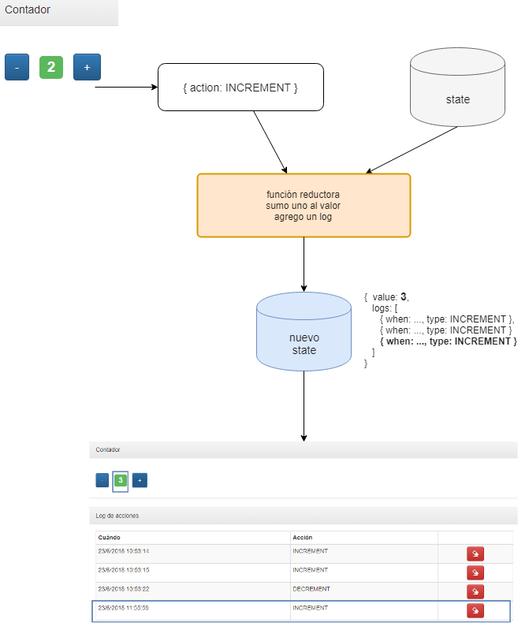
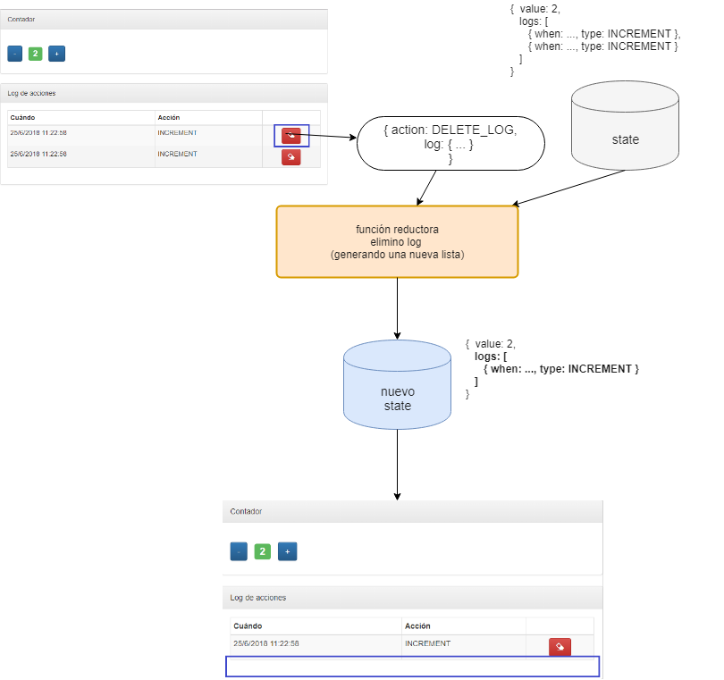

# Contador en React Redux

[](https://travis-ci.org/uqbar-project/eg-contador-react-redux)



# La aplicación

El ejemplo consiste en un simple contador numérico, al que le podemos incrementar o decrementar su valor de uno en uno. Para ayudar a entender el funcionamiento de React Redux, incorporamos un _log_ que mostrará cada operación de suma o resta que haya pedido el usuario, con la opción de poder borrarlo.

# React Redux

El framework React Redux permite unificar el estado entre los componentes de una aplicación a partir de

- un store, que representa ese estado compartido (una _shared memory_)
- acciones, que producen efectos colaterales sobre el estado
- y funciones reductoras, que con cada acción que se produce en lugar de modificar directamente el estado devuelve uno nuevo


## Breve introducción a React Redux


React redux agrega como conceptos:

- el **store** o estado que deberá compartirse entre los componentes, es básicamente un objeto javascript
- **actions**, que se ejecutan ante determinados eventos
- las acciones no modifican directamente el estado, tenemos una indirección o **dispatch**
- que concentra los cambios en una función **reducer** (la palabra reductora puede no decirnos nada, hasta que conozcamos la programación funcional y en particular la función fold), que recibe el estado actual, la información sobre la acción y devuelve un nuevo estado

## Antes de comenzar, un poco de programación funcional

En programación funcional, la función _reduce_ (que en otros lenguajes pueden encontrar como _inject_ o _fold_) permite resolver prácticamente cualquier solución que necesitemos con listas. 

Así, para sumar una lista de números, podemos hacer:

```javascript
> [1, 2, 3, 4].reduce((acum, elem) => acum + elem, 0)
10
```

¿Qué parámetros le pasamos a reduce?

- el segundo parámetro es "la semilla", o valor inicial con el que vamos a trabajar
- el primer parámetro es **la función reductora**, una función que recibe dos parámetros: el primero corresponde al valor "actual" de la reducción, y el segundo se completa con cada uno de los elementos de la lista. El resultado de la función (en este caso la suma) se devuelve valor a la siguiente iteración. Así los subtotales que se van formando son:

```
0   (semilla)
0 (acum) + 1 (elem) => 1
1 (acum) + 2 (elem) => 3 
3 (acum) + 3 (elem) => 6
6 (acum) + 4 (elem) => 10
```

10 es el valor final tras aplicar la reducción.

De la misma manera podemos obtener la productoria de números:

```javascript
[1, 2, 3, 4].reduce((acum, elem) => acum * elem)
24
```

E incluso podemos calcular el máximo de una lista de números:

```javascript
[1, 20, 13, 4].reduce((acum, elem) => Math.max(acum, elem))
20
```

Pero _reduce_ no se aplica solo a listas, también lo podemos aplicar para cualquier objeto. Por ejemplo, si tenemos una persona **inmutable**, podemos definir una función _cumplirAnios_ que en lugar de actualizar a la persona, devuelva **una nueva persona** con la edad incrementada:

```javascript
> const rodri = { nombre: 'Rodrigo Grisolía', edad: 28 }
> const cumplirAnios = (persona, cuantos) => { 
    return { nombre: persona.nombre, edad: persona.edad + cuantos } 
  }

> cumplirAnios(rodri, 1)
// devuelve --> {nombre: "Rodrigo Grisolía", edad: 29}
```

En el ejemplo de React redux vamos a hacer exactamente lo mismo.

- _cumplirAnios_ es nuestra función reductora
- _rodri_ (la persona), será el state original
- y el evento cumplirAnios se va a disparar a partir de una acción, generando un nuevo state

## Más tutoriales de React Redux

Si querés ver un tutorial en castellano didáctico, te recomendamos [este link](https://www.youtube.com/watch?v=RZNNu2pO49g&t=458s) (es el primero de varios videos, luego youtube hace su gracia y te va linkeando los demás).

## Los componentes

Tenemos tres componentes en nuestra aplicación:

- **Contador:** el label que muestra el valor y los dos botones para sumar o restar ese valor
- **LogContador:** el container general que genera la tabla y su encabezado, y trabaja con la lista de logs de las operaciones que se van produciendo
- **LogRow:** el componente que sabe mostrar un log dentro de una tabla



## Nuestro estado compartido

En el store vamos a definir como estado compartido el valor numérico actual y la lista de logs:

archivo _src/redux/store.js_

```javascript
export default createStore(reducer, { value: 0, logs: [] })
```

## Definiendo las acciones en la función reductora

Tendremos tres acciones: subir un valor (INCREMENT), bajar un valor (DECREMENT), ambas generan un nuevo log y eliminar un log (DELETE_LOG).

archivo _src/redux/store.js_

```javascript
export const INCREMENT = 'INCREMENT'
export const DECREMENT = 'DECREMENT'
export const DELETE_LOG = 'DELETE_LOG'

const reducer = (state, action) => {
    if (action.type === DELETE_LOG) {
        return {
            ...state,
            logs: state.logs.filter((log) => action.log.id !== log.id)
        }
    }
    const newLogs = state.logs.concat(new Log(action.type))
    if (action.type === INCREMENT) {
        return {
            value: state.value + 1,
            logs: newLogs
        }
    }
    if (action.type === DECREMENT) {
        return {
            value: state.value - 1,
            logs: newLogs
        }
    }
    return state
}
```

## Creando actions

La parte burocrática de Redux hay que cumplirla: generamos funciones que devuelven una action para que la función reductora las utilice:

archivo _src/redux/actions.js_

```javascript
import { INCREMENT, DECREMENT, DELETE_LOG } from "./store"

export function increment() {
    return {
        type: INCREMENT
    }
}

export function decrement() {
    return {
        type: DECREMENT
    }
}

export function deleteLog(log) {
    return {
        type: DELETE_LOG,
        log
    }
}
```

## Enlazando las acciones con cada componente

Mapearemos entonces en el componente contador:

- como **state del store** la propiedad value
- como **action**, un objeto que contiene el type INCREMENT, sin más parámetros


Y en el componente LogContador mapearemos:

- como **state del store** la propiedad logs
- como **action**, un objeto que contiene el type DELETE_LOG, con un parámetro: el log que queremos eliminar

## Acción incrementar valor

Veamos cómo debe funcionar el botón que sube un valor:



- el **reducer** del store para la acción INCREMENT recibe el state con el valor y la lista actual de logs, el action y devuelve un nuevo state con el valor incrementado (como el valor es un número, garantizamos su inmutabilidad), y con la lista de logs con un nuevo elemento que refleja la operación de incremento. 
- al devolver un nuevo estado, se dispara el **render** del componente Contador, ya que tiene mapeada la propiedad _value_ de la vista con el store. Esto fuerza un cambio en el DOM del HTML.

```javascript
class Contador extends Component {

    render() {
        return (
            <Panel>
                ...
                    <Label bsStyle="success">{this.props.value}</Label>
                    <Button bsStyle="primary" onClick={() => this.props.increment()}>+</Button>

```

- además, como el LogContador mapea la propiedad _logs_ de la vista con el store, esto también fuerza un cambio en el DOM del HTML, para reflejar una línea adicional que muestre el nuevo log.


## Acción eliminar log



Dentro del componente LogRow (en el archivo _/src/componentes/logContador.js_) mapeamos el botón que elimina un log con la correspondiente función que despacha la acción de Redux:

- el **reducer** del store para la acción DELETE_LOG recibe el state con la lista actual de logs y el value, el action y devuelve un nuevo state con el mismo valor original pero con una lista de logs que tiene un elemento menos. 
- al devolver un nuevo estado, se dispara el **render** del componente LogContador removiendo del DOM la fila de la tabla que contenía el log eliminado
- en cuanto al componente Contador, no se dispara el **render** ya que el _value_ mapeado por la vista no se modificó (pueden corroborarlo insertando console.log en el método)

```javascript
export class LogContador extends Component {

    render() {
        return (
                <tbody>
                    {this.props.logs.map((log) => <LogRow log={log} key={log.id} deleteLog={this.props.deleteLog} />)}
        )
    }
}

const mapStateToProps = state => {
    return {
        logs: state.logs
    }
}

const mapDispatchToProps = dispatch => {
    return {
        deleteLog: (log) => dispatch(deleteLog(log))
    }
}

export default connect(mapStateToProps, mapDispatchToProps)(LogContador)
```

Un último detalle, la función deleteLog se pasa desde el componente padre (LogContador) hacia el componente hijo (LogRow) para unificar el mapeo hacia las acciones que disparan los cambios en el store, gracias al manejo de referencias dinámico que tiene javascript (donde las funciones son un objeto más, tanto como un número o un string).

# Testing

El archivo de test no es fácil configurarlo, ya que estamos haciendo una prueba end-to-end desde la vista hacia todo el sistema de dispatch propio de Redux. Veamos:

## Setup

```javascript
import React from 'react'
import 'jest-enzyme'
import { configure } from 'enzyme'
import Adapter from 'enzyme-adapter-react-16'
import { mount } from 'enzyme'
import Contador from './components/contador'
import LogContador from './components/logContador'
import { createStore } from 'redux'
import { increment } from './redux/actions'
import { INCREMENT, reducerContador } from './redux/store'

configure({ adapter: new Adapter() })

let wrapperContador
let store

beforeEach(() => {
  store = createStore(reducerContador, { value: 0, logs: [] })
  wrapperContador = mount(<Contador store={store} />)
})
```

En el setup creamos un store **real** (no mockeado), utilizando la misma función reductora para el contador, y el mismo valor inicial (que podríamos haber importado de una constante en una única definición). Esto es porque si mockeamos el store, no va a funcionar el test que verifique que al presionar el botón + se sume uno en el valor de la vista (ya que el mock no cambia el estado del store).

El primer test es sencillo:

```javascript
it('el contador inicialmente está en 0', () => {
  const label = wrapperContador.find('Label')
  expect(label.text()).toBe("0")
})
```

Dado que en lugar de la función shallow() estamos usando la función mount(), tenemos el componente HTML cargado en profundidad (no necesitamos forzar los componentes hijos con el mensaje dive()). Entonces podemos buscar el Label que contiene el valor inicialmente en 0 (un String, salvo que el lector lo quiera convertir a un número).

El segundo test no es tan unitario: prueba que se presiona el botón +, eso mapea contra props.increment() que dispara la acción increment() hacia el store, que devuelve un nuevo estado y eso termina generando el render de la vista, por lo tanto esperamos que en el Label ahora esté el valor 1:

```javascript
it('cuando el usuario presiona el botón + el contador pasa a estar en 1', () => {
  const btnPlus = wrapperContador.find('button#plus')
  btnPlus.simulate('click')
  const label = wrapperContador.find('Label')
  expect(label.text()).toBe("1")
})
```

La función increment() devuelve simplemente un objeto con el type correspondiente, es un test menor:

```javascript
it('acción de incrementar', () => {
  expect(increment()).toEqual({ type: INCREMENT })
})
```

Para chequear que al presionar el botón + tenemos un nuevo log, debemos preguntarle al store si tiene un log adicional, ya que la vista no tiene ningún control que muestre la cantidad de logs:

```javascript
it('cuando el usuario presiona el botón + se agrega un log', () => {
  const btnPlus = wrapperContador.find('button#plus')
  btnPlus.simulate('click')
  expect(store.getState().logs.length).toBe(1)
})
```

Y el último test es una prueba end-to-end bastante exhaustiva: el usuario presiona el botón +, eso además de modificar el valor agrega un log. Entonces podemos presionar el botón "Eliminar log" para luego chequear que la lista de logs queda vacía:

```javascript
it('cuando el usuario presiona el botón Delete Log se elimina un log', () => {
  const btnPlus = wrapperContador.find('button#plus')
  btnPlus.simulate('click')
  const logs = store.getState().logs
  expect(logs.length).toBe(1)
  const logId = logs[0].id
  const wrapperLogContador = mount(<LogContador store={store} />)
  wrapperLogContador.find("button#delete_" + logId).simulate('click')
  expect(store.getState().logs.length).toBe(0)
})
```

